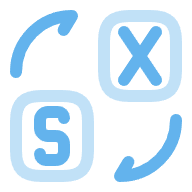
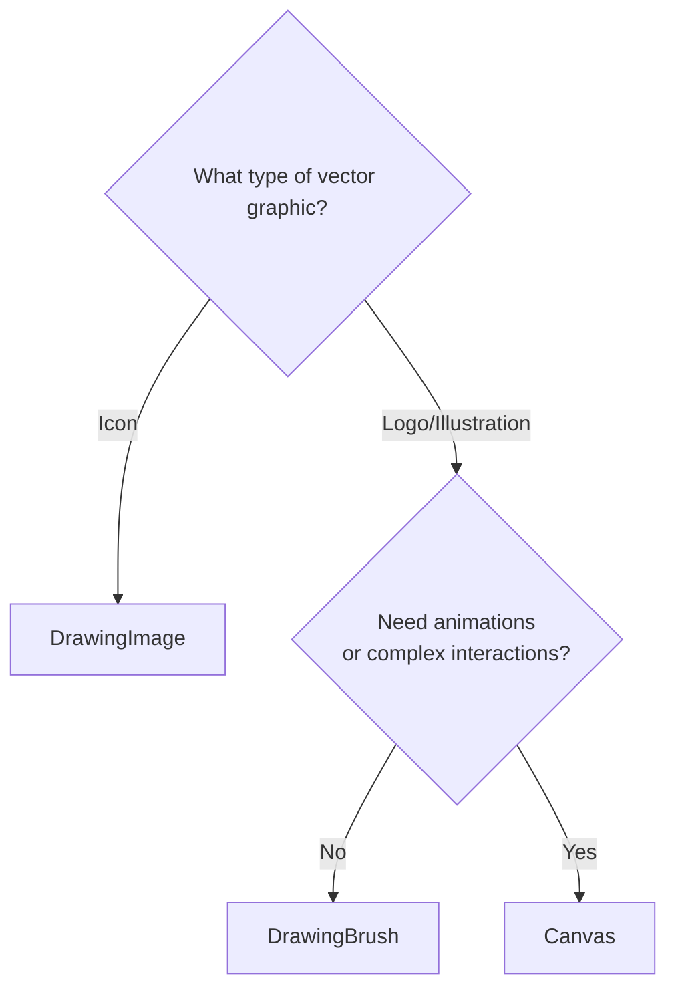
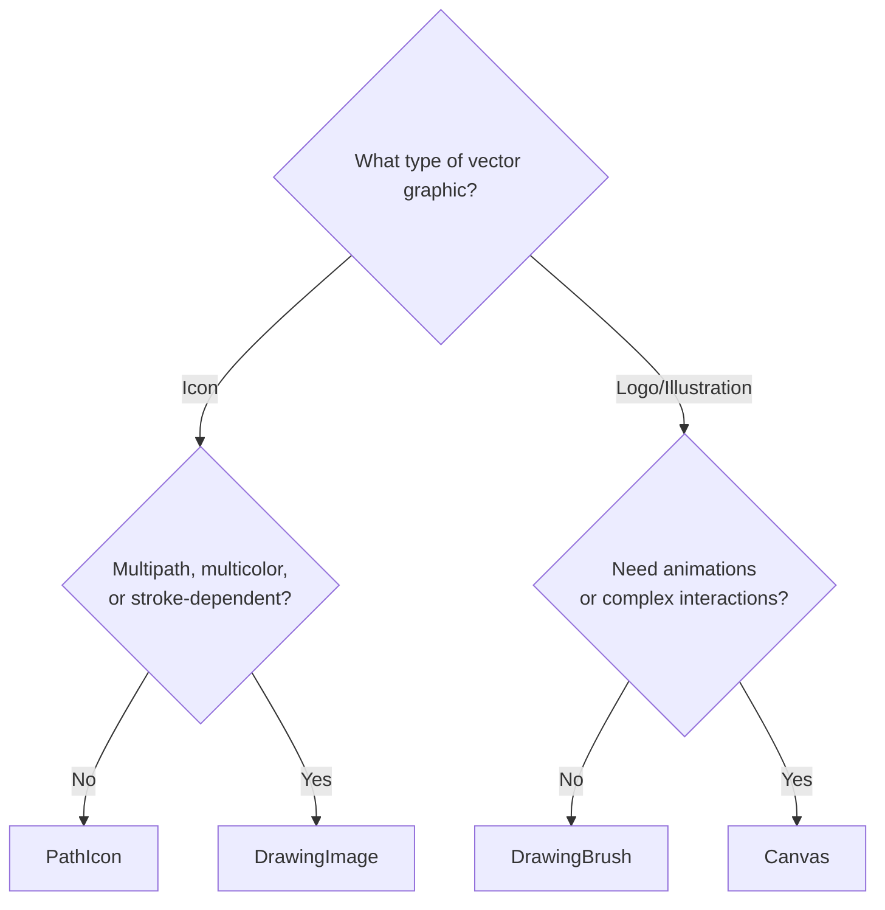
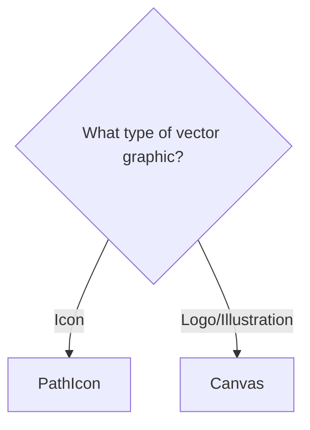

#  XVGO

[](https://dotnet.microsoft.com/)
[](https://dotnet.microsoft.com/apps/aspnet/web-apps/blazor)
[](https://github.com/microsoft/fluentui-blazor)
[](LICENSE.txt)

XVGO is an SVG to XAML converter for WPF, Avalonia, WinUI, and Uno Platform.

🌐 **Try it live:** [https://ent3m.github.io/xvgo/](https://ent3m.github.io/xvgo/)

## Features

- **SVG optimization** via SVGO before conversion
- **Multiple XAML output types**: `Canvas`, `DrawingBrush`, `DrawingImage`, `PathIcon`
- **Flexible usage context**: `Standalone` or `ResourceDictionary`
- **Multi-framework support**: WPF, Avalonia, WinUI, and Uno Platform
- **Configurable output**: indentation style, single-line or multi-line, resource key
- **Lightweight**: AOT-compiled for native performance
- **Fully client-side**: runs entirely in the browser — no server, no data sent anywhere

### Supported SVG Features

| Feature | Status |
| :--- | :---: |
| Basic shapes and paths | ✅ |
| Fill, stroke, and opacity | ✅ |
| Hex, named, `rgb`/`rgba` colors | ✅ |
| Inline and inherited styles/attributes | ✅ |
| `currentColor` | ✅ |
| `hsl`/`hsla`, gradients, `url()` references | ❌ |
| Text, images, patterns, clip paths | ❌ |
| Complex transforms | ❌ |

## Supported Frameworks

| Output | Avalonia | WPF | WinUI | Uno* |
| :--- | :---: | :---: | :---: | :---: |
| `<Canvas>` | ✅ | ✅ | ✅ | ✅ |
| `<DrawingBrush>` | ✅ | ✅ | ❌ | ❌ |
| `<DrawingImage>` | ✅ | ✅ | ❌ | ❌ |
| `<PathIcon>` | ✅ | ❌ | ✅ | ✅ |

*_Uno Platform does not support stroke-linejoin, stroke-linecap, stroke-miterlimit, stroke-dashoffset._


`SvgImageSource` is recommended for [Uno Platform](https://platform.uno/docs/articles/features/svg.html) and [WinUI](https://learn.microsoft.com/en-us/uwp/api/windows.ui.xaml.media.imaging.svgimagesource).
`MauiImage` is recommended for [MAUI](https://learn.microsoft.com/en-us/dotnet/maui/user-interface/images/images).

## Output Types

### `Canvas`
Generates a `ViewBox` → `Canvas` → `Path` hierarchy. `Path` is a `UIElement` that participates in the layout engine, enabling complex interactions and per-element animations. Faithfully reproduces the original SVG, but at a higher performance cost than geometry-based outputs.

### `DrawingBrush`
Generates a `Rectangle` → `DrawingBrush` → `GeometryDrawing` hierarchy. Correctly preserves the original SVG `viewBox` size, padding, and offsets. A high-performance option and the recommended default for faithful SVG rendering.

### `DrawingImage`
Generates an `Image` → `DrawingImage` → `GeometryDrawing` hierarchy. Unlike `DrawingBrush`, `viewBox` padding and offsets are not preserved — content is automatically centered and stretched to fill the available area. Best suited for rendering complex multi-path or multi-color icons.

### `PathIcon`
Generates a `PathIcon` for standalone use, or a `PathIconSource`/`StreamGeometry` for `ResourceDictionary`. Best for simple, single-path icons that benefit from color inheritance (adapting to the foreground color of their parent control).<br/>
*Tip*: Enable "Force Merge" to turn multi-path SVG into clean `PathIcon`.

## Which output to choose?

<details>
<summary><b>WPF</b></summary>



</details>

<details>
<summary><b>Avalonia UI</b></summary>



</details>

<details>
<summary><b>WinUI/Uno Platform</b></summary>



</details>

## Running Locally

**Prerequisites**: [.NET 10 SDK](https://dotnet.microsoft.com/en-us/download/visual-studio-sdks) and [Visual Studio](https://visualstudio.microsoft.com/vs/) with "ASP.NET and web development" workload.
```bash
git clone https://github.com/ent3m/xvgo.git
cd xvgo/XVGO
dotnet run
```
- Change `base href` to `<base href="/" />` in `wwwroot/index.html`
- Open `https://localhost:7000` (or the URL printed by the dev server).

## Credits

- [SVGO](https://github.com/svg/svgo) for its optimization tool
